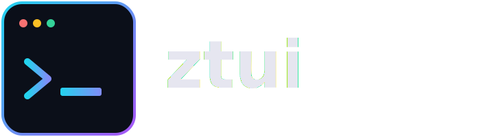

<div align="center">
  

  <h3>A small, dependency-free terminal UI toolkit for Zig.</h3>

  <p>
    <a href="https://github.com/abdullah4tech/ztui/actions/workflows/ci.yml"></a>
    
    
    
  </p>
</div>

---

**ztui** brings the immediate-mode rendering model of Rust's [ratatui](https://ratatui.rs)
to Zig: build a `Buffer` of styled cells every frame, hand it to the `Terminal`,
and only the cells that actually changed get written to the screen. No
dependencies, no allocations you didn't ask for, no runtime beyond what's
already in `std`.

```zig
const ztui = @import("ztui");

const frame: ztui.Block = (ztui.Block{})
    .withTitle("ztui — hello")
    .withBorderStyle(ztui.Style.default.withFg(.cyan).bold());
frame.render(area, buf);

(ztui.Paragraph{
    .text = "Hello from ztui!\n\nPress q to quit.",
    .alignment = .center,
}).render(frame.inner(area), buf);
```

## Why ztui

- **Zero dependencies.** Only `std` — raw mode and the alternate screen are
  driven directly through `termios` and ANSI escapes.
- **Diff-based rendering.** Each frame is diffed against the last one; only
  changed cells are written, so redraws stay cheap even on a full-screen UI.
- **Small, composable core.** Widgets are just structs with a
  `render(area, buffer)` method — no inheritance, no vtables, nothing to
  learn beyond function calls.
- **A layout engine you already know.** `split()` divides a `Rect` using
  `Length` / `Percentage` / `Min` / `Max` / `Fill` constraints, the same
  model ratatui popularized.

## Install

```sh
zig fetch --save https://github.com/abdullah4tech/ztui/archive/refs/heads/main.tar.gz
```

```zig
// build.zig
const ztui = b.dependency("ztui", .{ .target = target, .optimize = optimize });
exe.root_module.addImport("ztui", ztui.module("ztui"));
```

Prefer a local checkout instead? Point `build.zig.zon` at a path dependency:

```zig
.dependencies = .{
    .ztui = .{ .path = "../path/to/ztui" },
},
```

Or skip the setup entirely and scaffold a ready-to-run project:

```sh
zig build create -- myapp
cd myapp
zig build run
```

`create` wires up `build.zig`, `build.zig.zon`, and a starter `main.zig` for
you — the same idea as `npm create vite@latest`, just for a Zig TUI.

## The core pieces

| Module      | What it does                                                             |
| ----------- | ------------------------------------------------------------------------- |
| `Style`     | Foreground/background `Color` (named, 256-color, or 24-bit RGB) + bold/italic/underline/dim/reverse modifiers. |
| `Buffer`    | A grid of `Cell`s. Widgets only ever write into a `Buffer` — never the terminal directly. |
| `layout`    | `Rect` + `split()` for dividing space with `Length` / `Percentage` / `Min` / `Max` / `Fill` constraints. |
| `Terminal`  | Owns raw mode, the alternate screen, cursor visibility, and double-buffered diff rendering. |
| `Block`     | A bordered, optionally-titled frame. Call `.inner(area)` to get the content area for whatever you render next. |
| `Paragraph` | Styled, word-wrapped text with left/center/right alignment. |
| `List`      | A vertical list of items with a selectable, auto-scrolling highlight. |

```zig
const rows = try ztui.split(allocator, area, .vertical, &.{
    .{ .length = 3 },   // header
    .{ .fill = 1 },     // body grows to fill remaining space
    .{ .length = 1 },   // footer
});
```

## Examples

```sh
zig build run-hello       # minimal: a bordered, centered message
zig build run-dashboard   # composed layout: header, list, detail pane, footer
```

`dashboard` looks roughly like this (colors and live selection only show up
in a real terminal — run it to see it properly):

```
┌────────────────────────────────────────────────────────────┐
│           ztui — a small terminal UI toolkit for Zig        │
├───────────────────┬──────────────────────────────────────────┤
│ menu              │ details                                  │
│ ❯ Overview        │ ztui renders into an in-memory cell      │
│   Buffers         │ buffer, diffs it against the previous    │
│   Widgets         │ frame, and writes only what changed      │
│   Layout engine   │ to the terminal.                         │
│   Terminal backend│                                          │
│   Examples        │                                          │
└───────────────────┴──────────────────────────────────────────┘
                 ↑/↓ or j/k to move   q to quit
```

## Project status

This is v0.1: the core primitives (buffer, layout, terminal backend, three
widgets) work and are tested, but the widget set is intentionally small.
Not yet implemented: rich multi-style text spans, more widgets (Table,
Gauge, Chart, Tabs), mouse input, and a Windows console backend — raw mode
and the alternate screen are currently POSIX-only (Linux/macOS).

## License

MIT — see [LICENSE](LICENSE).
